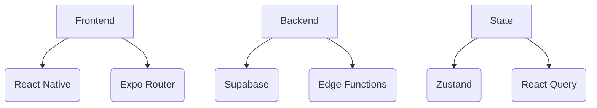

# Core Architecture

## Technical Stack

## Critical Path Modules
1. **Authentication Gateway**
   - OAuth2 flows
   - JWT refresh cycles
   - Biometric integration

2. **Verification Engine**
   - Document OCR
   - Live photo liveness check
   - College database cross-check

3. **Content Pipeline**
   - Markdown/MathJax support
   - Media transcoding
   - Cache invalidation strategy

## Performance Targets
| Metric | Baseline | Target |
|--------|----------|--------|
| Auth Latency | 2.8s | <1.5s |
| Feed Load | 3.2s | <2s |
| Search Results | 1.8s | <1s | 