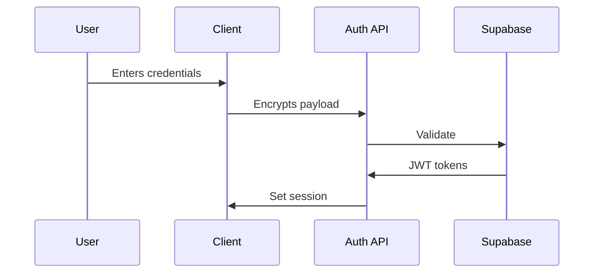

# Phase 1: Foundation Setup (Weeks 1-4)

## Authentication System

## Key Deliverables
1. **Auth Flow Components**
   - Login/Register screens
   - Password reset flow
   - Email verification process
   
   - Session management
   - Protected route middleware

2. **Project Infrastructure**
   - Expo monorepo setup
   - CI/CD pipelines
   - Error monitoring (Sentry)
   - Environment configuration
   - Testing framework setup (Jest)
   - Code quality tools (ESLint, Prettier)
   - Documentation system
   - Git workflow & branching strategy

3. **UI Foundation**
   - Design system core
     - Typography system
     - Color palette
     - Spacing scales
     - Component library setup
   - Navigation framework
     - Stack navigation
     - Tab navigation
     - Deep linking setup
   - Accessibility audit 
     - Screen reader compatibility
     - Color contrast validation
     - Focus management
     - Keyboard navigation support
Set up the authentication flow components
Implement the UI foundation
3. Configure Sentry for error monitoring
Set up the testing framework
