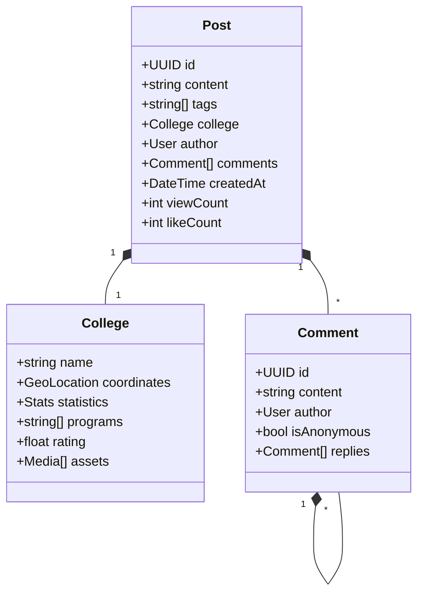

# Phase 3: Forum & Database (Weeks 9-12)

## Academic Forum Implementation

## Key Deliverables
1. **Real-time Discussion System**
   - Content Management
     - Rich text editor with Markdown
     - LaTeX/MathJax integration
     - Code snippet support
     - Image upload & optimization
   - Interaction Features
     - Real-time commenting
     - Threading system
     - @mentions and notifications
     - Anonymous posting options
   - Moderation Tools
     - Content filtering
     - Report handling
     - Auto-moderation rules
     - Spam prevention

2. **College Database System**
   - Data Collection
     - IPEDS integration
     - Web scraping pipeline
     - API integrations
     - Manual data entry tools
   - College Profiles
     - Dynamic statistics
     - Program listings
     - Media galleries
     - Review system
   - Comparison Engine
     - Custom metrics
     - Side-by-side view
     - Data visualization
     - Export functionality

3. **Search Infrastructure**
   - ElasticSearch Implementation
     - Custom analyzers
     - Relevance tuning
     - Query optimization
     - Caching layer
   - Advanced Search Features
     - Geo-spatial queries
     - Faceted search
     - Auto-complete
     - Did you mean?
   - AI-Enhanced Search
     - BERT embeddings
     - Semantic matching
     - Query understanding
     - Personalized results

## Success Criteria
- ✅ Forum supports 1000+ concurrent users
- ✅ Search results in <200ms
- ✅ College database covers 95% of US institutions
- ✅ Real-time updates with <100ms latency
- ✅ AI search accuracy >90%
- ✅ Test coverage >85%

## Performance Considerations
- Redis caching for hot data
- CDN integration for media
- Database query optimization
- WebSocket connection management
- Search result pagination
- Lazy loading for media assets 