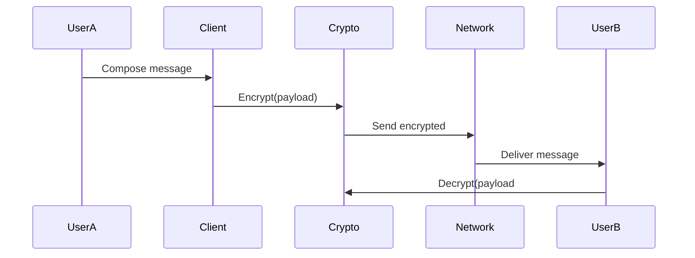

# Phase 4: Secure Messaging (Weeks 13-16)

## Messaging Architecture

## Security Features
- Double Ratchet protocol
- Ephemeral messages
- Forward secrecy implementation

## Technical Components
| Component | Technology | Purpose |
|-----------|------------|---------|
| Encryption | Olm lib | E2EE |
| Storage | IndexedDB | Offline cache |
| Transport | Socket.IO | Real-time | 