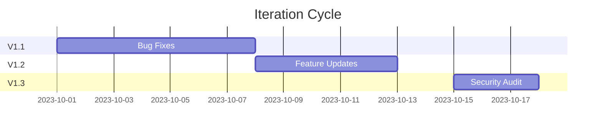

# Phase 6: Launch & Iteration (Weeks 21-24)

## Launch Preparation
1. **App Store Optimization**
   - Keyword research (AppFollow)
   - Screenshot A/B testing
   - Localized descriptions

2. **Monitoring Setup**
   - Error tracking (Sentry)
   - Performance (New Relic)
   - Security (OSSEC)

## Post-Launch Cycle
