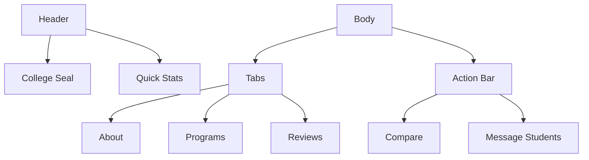

# Key Screen Prototypes

## Home Feed Layout
```plaintext
[AppBar]
- Search Button
- Notifications
- Profile Quick Access

[Main]
- Floating Action Button (Create Post)e Post)e Post)e Pe Post)
- Segmented Control (All/Followingost)
- Segmented Control (All/Following
- Segmented Control (All/Following
- Segmented Control (All/Followinge Post)
- Segmented Control (All/Following
- Segmented Control (All/Following/Trending)
- Post List (Virtualized)
  - Author Card
  - College Tag
  - Content Body
  - Interaction Bar

[Bottom Nav]
- Home | Search | Messages | Profile
```

## College Profile UI
