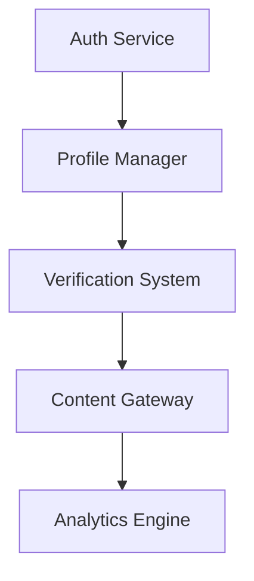

# CampusConnect Development Master Plan

## Core Concept
**Pseudonymous Academic Social Platform** connecting:
- Prospective students ↔ Verified current students
- Alumni ↔ Faculty
- Cross-institution academic communities

### Key Differentiators
1. Identity-protected interactions
2. College-verified user system
3. Academic-focused content ecosystem
4. Secure peer-to-peer mentoring

## Current Status (Phase 1.5)
```progress
▓▓▓▓▓▓▓▓▓▓░░░░ 65% 
```
**Completed:**
- Expo + Supabase foundation
- Basic auth flows
- Profile schema design
- Initial forum components

**Immediate Next:**
1. Finish auth-zustand integration
2. Complete profile editing system
3. Implement college verification MVP
4. Optimize post rendering performance

## Development Roadmap

### Phase 1: Core Infrastructure (Current)
```plaintext
Deadline: July 30 | Priority: Critical Path
```
**Objectives:**
- [ ] Auth Service Finalization
  - Social login callbacks
  - Session persistence
  - Error recovery flows

- [ ] State Management
  - Zustand stores for auth/profile
  - React-Query integration
  - Cache invalidation strategy

- [ ] Performance Foundation
  - Image caching system
  - List virtualization
  - Network optimization

### Phase 2: Identity System (Next)
```plaintext
Est. Start: Aug 1 | Duration: 3 weeks
```
**Key Components:**
1. **Profile System**
   - Pseudonym management
   - College affiliation display
   - Privacy controls

2. **Verification Flow**
   - Document upload pipeline
   - College email validation
   - Manual review interface

3. **Trust Architecture**
   - Reputation scoring
   - Content access tiers
   - Moderation tools

### Phase 3: Academic Ecosystem
```plaintext
Est. Start: Aug 21 | Duration: 4 weeks
```
1. College Database
   - Searchable directory
   - Statistics dashboard
   - Review system

2. Forum System
   - Post types: Question/Experience/Resource
   - College-specific channels
   - Academic content filtering

3. Mentorship Features
   - Anonymous Q&A
   - Verified expert tagging
   - Resource sharing

### Phase 4: Community Growth
```plaintext
Est. Start: Sep 18 | Duration: 3 weeks
```
1. Engagement Features
   - Reputation rewards
   - Badge system
   - Leaderboards

2. Moderation Tools
   - Automated content scanning
   - User reporting flows
   - Admin dashboard

3. Network Effects
   - Referral system
   - Cross-college events
   - Alumni integration

## Technical Implementation Map

### Core Services


### Key Feature Requirements
1. **Profile System**
   - Real-time username check
   - Avatar upload with moderation
   - College affiliation display rules

2. **Verification Flow**
   - Document type detection
   - EXIF data scrubbing
   - Manual review interface

3. **Forum System**
   - College-gated content
   - Anonymous posting
   - Academic content sorting

### Security Priorities
1. Data Encryption
   - Sensitive fields at rest
   - Secure file storage
   - Session encryption

2. Privacy Protections
   - Pseudonym persistence
   - Interaction masking
   - Secure deletion flows

3. Moderation
   - Automated content scanning
   - Report triaging
   - Audit trails

## Milestone Timeline

```timeline
August 2023:
- [ ] Auth/Profile Completion (8/10)
- [ ] Verification MVP (8/18)
- [ ] Forum v1 Launch (8/25)

September 2023:
- [ ] College Database (9/8)
- [ ] Moderation Tools (9/15)
- [ ] Mobile Optimization (9/22)

October 2023:
- [ ] Reward System (10/6)
- [ ] Alumni Features (10/13)
- [ ] v1 Launch Prep (10/27)
```

## Risk Management

| Risk | Mitigation Strategy |
|------|----------------------|
| Verification Abuse | Document hashing + Manual review |
| Content Moderation | Hybrid AI/Human system |
| Network Effects | College ambassador program |
| Data Privacy | Regular third-party audits |
| Performance | Progressive loading + Edge caching |

## Quality Assurance Plan

1. **Testing Layers**
   - Unit: Core utilities
   - Integration: Auth flows
   - E2E: User journeys

2. **Load Testing**
   - Concurrent verification requests
   - High-density chat rooms
   - Search performance

3. **User Testing**
   - Prospective student cohort
   - College admin group
   - Alumni panel
```

This plan synthesizes requirements from:
- User identity needs (`userstuff.md`)
- Technical roadmap (`planCCNetDEv.md`)
- Immediate next steps (`nextstep.md`)
- Current codebase status

Would you like me to create any specific implementation guides from this plan?